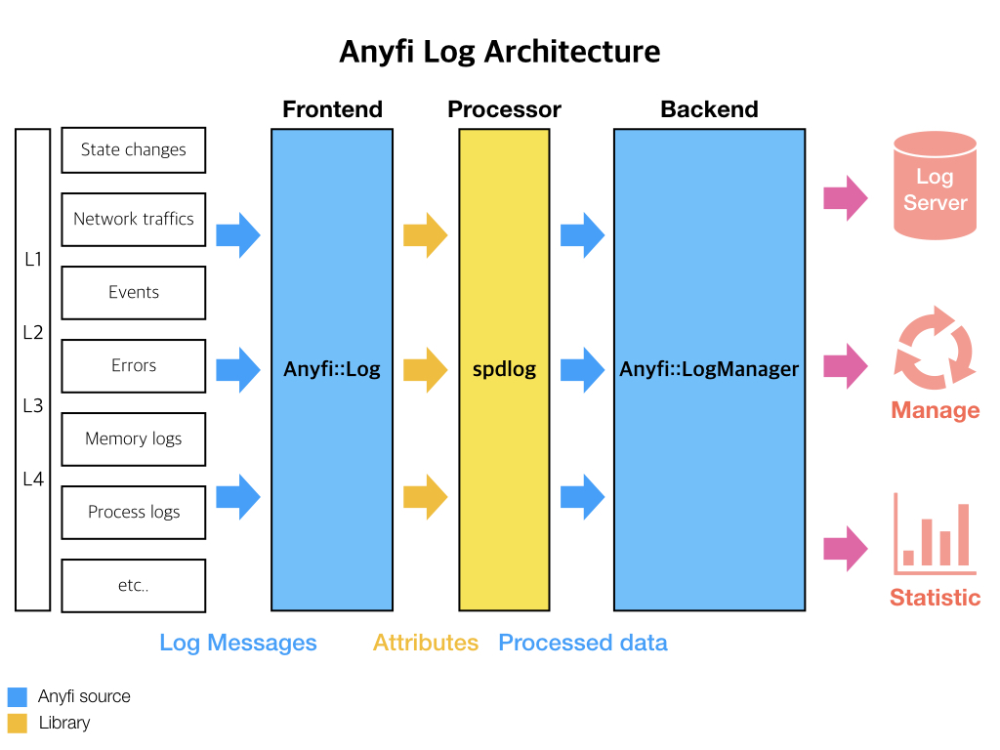

# Anyfi Log Module
AnyfiMesh-Core 에서 발생하는 이벤트, 트래픽, 에러 등의 로그 정보를 기록하고 처리하는 모듈

## Architecture

### Frontend : Anyfi::Log
Anyfi::Log 클래스는 Anyfi Log Module의 Frontend
AnyfiMesh-Core에서 발생하는 다양한 로그 메세지들을 수신,  
attribute를 분리해서 Processor로 전송하는 역할 수행

### Log message format
`[time] [log level] [tag] [message]`
* time : log message가 발생하는 시간
* log level: debug, error 등과 같은 로깅 레벨
* tag : log message 발생을 일으키는 layer 혹은 객체
    * 각 Layer
    * Layer 내부의 객체 혹은 Layer 전반에 걸쳐 작동하는 객체 
    * `Log` class 안에 public scope에  `static std::string` 형식으로 선언
* message : log message 본문

### Log message level 
* debug : 개발 단계에서 필요한 정보들을 확인
* error : 프로그램 실행 중 발생하는 에러 내용 확인
* warning : 정상적으로 실행되었지만 원하는 결과가 아닌 경우의 로그
* record : backend, 통계, 앱 모니터링 등 기타 기록이 필요한 로그

### Log message filtering
* 어떤 log를 출력할지 결정
* `Log` class 내부 public scope에 `static enum logFilter`에 종류를 나열
* `FILTERED_LOG`의 값으로 원하는 값으로 filtering 가능

### Processor : spdlog
Anyfi Log Module의 Processor는 직접 구현하지 않고 `spdlog`라이브러리를 사용하기로 했습니다.
**spdlog**를 선택한 이유는 다음과 같습니다.

- Cross-platform support
- Multi-thread support + Extremely fast asynchronous networkMode
- Header only 및 C++11 : 가볍게 포팅 가능
- Fastest log library in C++ : traffic 로그 사용시 이점
- Conditional Logging
- Daily log file
- Console logging (Color support)
- Severity based filtering

### Backend : Anyfi::LogManager
Anyfi::LogManager 클래스는 Anyfi Log Module의 Backend입니다.
Processor에서 처리한 로그 데이터를 기반으로, 사용자 통계, 로그 서버 전송, AnyfiMesh-Core 작동 관리등을 수행하도록 합니다.